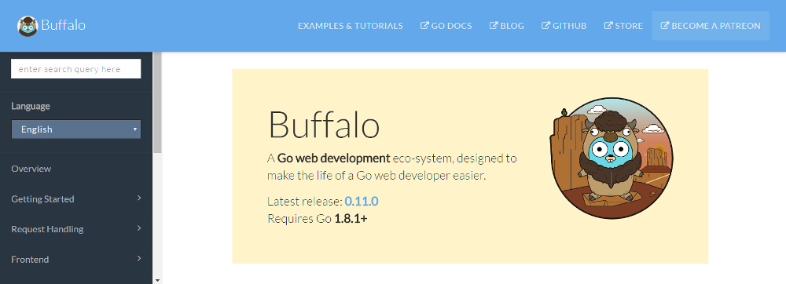

# Buffalo Documentation

This is the repository for https://www.gobuffalo.io, the official website of the [Buffalo ecosystem](https://github.com/gobuffalo).

This documentation contains:
* The [Buffalo Documentation](https://gobuffalo.io/docs/installation)
* The [Pop Documentation](https://gobuffalo.io/docs/db/getting-started)

## Contributing

Contributing to this documentation site is a great, and easy, way to help make Buffalo better!

Note that this repository is only about Buffalo ecosystem documentation. If you want to contribute to the ecosystem itself, please refer to the concerned repository:
* [Buffalo](https://github.com/gobuffalo/buffalo)
* [Pop](https://github.com/gobuffalo/pop)
* [Plush](https://github.com/gobuffalo/plush)

See [the contribution guide](CONTRIBUTING.md) for more info about how to contribute.